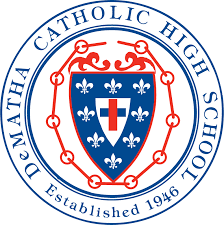

  

# DeMatha Cyber Team 

Repository for DeMatha Cyber Team which includes resources, team description, and information. 

## Team Description

The DeMatha Cyber Team consists of students who seek to learn, explore, and challenge oneself across various information security domains outside of the classroom. The team is comprised of students from every grade with an interest in information security and capture the flag (CTF) competitions. The students compete in high school and collegiate level CTFs locally, nationally, and internationally. Many of the competitions are completed online with a few hosted at local institutions. At practices, cyber team members hone their skills using the wide range of online challenges, tutorials, walkthroughs, and, if possible, in-person presentations. The cyber team is best suited for students with a strong desire to study computer science in college and pursue a career as a cybersecurity professional. There is no baseline level of knowledge required for the team. 